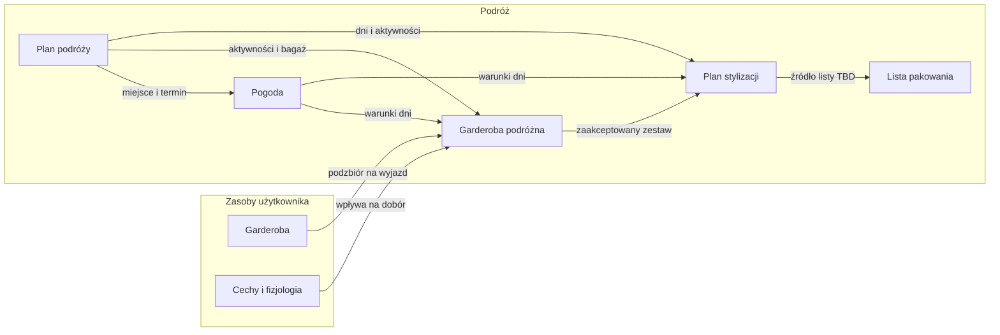

# Architektura informacji MVP

Źródła: [backlog.md](backlog.md), [requirements.md](requirements.md). Język pojęć zgodny ze [słownikiem](glossary.md). Ten dokument **nie** projektuje ekranów, nawigacji UI ani user flow.

Otwarte decyzje produktowe, które mogą zmienić hierarchię: [gaps.md](gaps.md). Pytania dotyczące samej IA — na końcu tego pliku.

**Zasada podziału:** epiki opisują etapy procesu (zebranie planu → digitalizacja → dobór → stylizacje → pakowanie → użycie w podróży). Hierarchia informacji wynika z tego, **do czego dane należą** i **jakie potrzeby obsługują**, a nie z numeracji epiców.

- **Zasoby użytkownika** — dane niezależne od konkretnego wyjazdu (szafa cyfrowa; ewentualnie cechy użytkownika).
- **Podróż** — kontekst i artefakty jednego wyjazdu (plan, pogoda, garderoba podróżna, plan stylizacji, lista pakowania).

Epic 6 nie jest osobnym obszarem informacyjnym: to ten sam **plan stylizacji**, używany w trakcie wyjazdu.

---

## 1. Skrócona architektura informacji

```
Aplikacja MVP
├── Zasoby użytkownika
│   ├── Garderoba
│   │   ├── Elementy (zdjęcie, kategoria, kolor, pozostałe dane)
│   │   └── Operacje (dodawanie zdjęć, rozpoznanie, weryfikacja, edycja, usuwanie)
│   └── Cechy i fizjologia   ← lokacja otwarta, zob. pytania
│       ├── Cechy wpływające na ponowne użycie ubrań
│       └── Informacje fizjologiczne wpływające na dobór
└── Podróż
    ├── Plan podróży
    │   ├── Miejsce
    │   ├── Termin i długość pobytu
    │   ├── Rodzaj bagażu
    │   └── Planowane aktywności
    ├── Pogoda
    │   ├── Pogoda na każdy dzień podróży
    │   └── Informacja o braku lub ograniczonej prognozie
    ├── Garderoba podróżna
    │   ├── Rekomendowany zestaw i liczba elementów
    │   ├── Uzasadnienie wyboru i uniwersalność
    │   └── Akceptacja, odrzucenie i modyfikacja
    ├── Plan stylizacji
    │   ├── Stylizacja dnia (wizualizacja, ubrania, pogoda, aktywności)
    │   └── Akceptacja, odrzucenie, alternatywa (bez zmiany innych zaakceptowanych dni)
    └── Lista pakowania
        ├── Rzeczy pogrupowane według kategorii
        └── Oznaczanie spakowanych i postęp pakowania
```



```mermaid
flowchart TB
  App[Aplikacja MVP]

  App --> User[Zasoby użytkownika]
  App --> Trip[Podróż]

  User --> Wardrobe[Garderoba]
  User --> Traits[Cechy i fizjologia]

  Wardrobe --> Items[Elementy]
  Wardrobe --> Ops[Operacje]
  Traits --> TraitReuse[Cechy wpływające na ponowne użycie ubrań]
  Traits --> TraitPhysio[Informacje fizjologiczne wpływające na dobór]

  Trip --> Plan[Plan podróży]
  Trip --> Weather[Pogoda]
  Trip --> TravelWardrobe[Garderoba podróżna]
  Trip --> Outfits[Plan stylizacji]
  Trip --> Packing[Lista pakowania]

  Plan --> Place[Miejsce]
  Plan --> Dates[Termin i długość pobytu]
  Plan --> Luggage[Rodzaj bagażu]
  Plan --> Activities[Planowane aktywności]

  Weather --> WeatherDays[Pogoda na każdy dzień podróży]
  Weather --> WeatherMissing[Brak lub ograniczona prognoza]

  TravelWardrobe --> RecSet[Rekomendowany zestaw i liczba elementów]
  TravelWardrobe --> RecWhy[Uzasadnienie wyboru i uniwersalność]
  TravelWardrobe --> RecEdit[Akceptacja, odrzucenie i modyfikacja]

  Outfits --> OutfitDay[Stylizacja dnia]
  Outfits --> OutfitEdit[Akceptacja, odrzucenie, alternatywa]

  Packing --> PackCats[Rzeczy pogrupowane według kategorii]
  Packing --> PackProgress[Oznaczanie spakowanych i postęp pakowania]
```

Mapowanie epiców (żeby nie mylić procesu z IA):

- Epic 1 → Plan podróży
- Epic 2 → Garderoba (zasób użytkownika)
- Epic 3 → Garderoba podróżna (wejścia: plan, pogoda, szafa, cechy)
- Epic 4 + Epic 6 → Plan stylizacji (przygotowanie vs użycie w trakcie wyjazdu)
- Epic 5 → Lista pakowania

Relacje między głównymi obszarami:



---

## 2. Szczegółowa architektura informacji

### 2.1 Garderoba (zasób użytkownika)

**Cel:** cyfrowa reprezentacja ubrań użytkownika, z której system później wybiera zestaw na konkretną podróż (BR-2.1, BR-3.1).

**Informacje:**

- element garderoby / ubranie (po akceptacji rozpoznania),
- zdjęcie elementu,
- kategoria,
- kolor,
- pozostałe dane ubrania (FR-2.14; skład atrybutów nie jest zamknięty w wymaganiach).

**Funkcje:**

- dodanie zdjęcia z aparatu lub galerii,
- przetwarzanie kilku ubrań na jednym zdjęciu, w tym wariantu jednej kategorii,
- automatyczne rozpoznanie ubrania, kategorii i koloru,
- weryfikacja i akceptacja rozpoznanych elementów,
- edycja kategorii, koloru i pozostałych danych,
- usunięcie elementu (błędnie rozpoznanego lub wcześniej zaakceptowanego).

**Relacje:**

- dostarcza pulę elementów do **Garderoby podróżnej**,
- zdjęcia elementów są wykorzystywane w **Planie stylizacji** (wizualizacja i lista użytych ubrań),
- nie należy do konkretnej podróży: podróż jest kontekstem doboru, nie kontenerem szafy (wynika z BR-2.1 vs BR-3.1; potwierdzenie w pytaniach).

Digitalizacja (Epic 2) to operacje na tym zasobie, nie osobny obszar informacji.

---

### 2.2 Cechy i fizjologia (zasób użytkownika — lokacja do potwierdzenia)

**Cel:** informacje o użytkowniku wpływające na częstotliwość ponownego użycia ubrań i dobór garderoby (FR-3.8–FR-3.10), np. szybkie brudzenie, pocenie.

**Informacje i funkcje wynikające z wymagań:**

- określenie cech wpływających na ponowne wykorzystanie ubrań,
- określenie informacji fizjologicznych wpływających na dobór,
- uwzględnienie tych danych przy rekomendacjach.

**Relacje:** wejście do **Garderoby podróżnej**. Wymagania nie mówią, czy to profil trwały, czy dane zbierane przy konkretnym wyjeździe — w drzewie umieszczone przy zasobach użytkownika tylko jako robocze przypisanie, nie jako decyzja.

W backlogu nie ma osobnego epica „profil”. To nie pretendent do głównej nawigacji, tylko grupa danych.

---

### 2.3 Plan podróży

**Cel:** zebrać kontekst wyjazdu, który jest podstawą dalszego doboru garderoby i stylizacji, z kontrolą danych przed przejściem dalej (BR-1.1–BR-1.3).

**Informacje:**

- miejsce podróży,
- data rozpoczęcia i data zakończenia,
- długość pobytu (wyliczana automatycznie, prezentowana użytkownikowi),
- rodzaj bagażu (i wynikająca z niego pojemność jako ograniczenie),
- planowane aktywności,
- podsumowanie przed zatwierdzeniem: miejsce, termin, długość, bagaż, aktywności.

**Funkcje:**

- wskazanie i zmiana miejsca (w tym wyszukiwanie z podpowiedziami),
- wskazanie i zmiana terminu,
- wybór i zmiana rodzaju bagażu,
- wskazanie aktywności i zapisanie ich jako element planu,
- powrót do wcześniejszych kroków przed zatwierdzeniem,
- zatwierdzenie planu i przejście do doboru garderoby.

**Relacje:**

- miejsce + termin → **Pogoda**,
- aktywności + bagaż → **Garderoba podróżna** i **Plan stylizacji**,
- długość pobytu / dni → liczba dni, dla których powstają pogoda i stylizacje,
- zatwierdzony plan jest warunkiem doboru (FR-1.17).

Podsumowanie to ten sam zestaw danych w stanie przeglądu, nie osobny obszar.

Ostrzeżenie o pojemności bagażu (FR-1.12) jest funkcją związaną z bagażem, ale w wymaganiach pojawia się przy „rekomendowanych lub wybranych rzeczach”, których jeszcze nie ma w planie — relacja z **Garderobą podróżną** / **Listą pakowania** pozostaje otwarta.

---

### 2.4 Pogoda

**Cel:** kontekst pogodowy konkretnej podróży, widoczny dla użytkownika i używany przy doborze oraz stylizacjach.

**Informacje i funkcje:**

- pogoda na każdy dzień podróży (do wglądu),
- uwzględnienie prognozy przy doborze garderoby i przy generowaniu stylizacji,
- informacja, gdy szczegółowa prognoza dla terminu nie jest dostępna.

**Relacje:**

- pochodzi z **Planu podróży** (miejsce, termin, dni),
- wejście do **Garderoby podróżnej** i **Planu stylizacji**.

To nie jest osobny etap procesu (brak epica), ale osobna grupa informacji: użytkownik jej nie wprowadza w Epic 1, a korzysta z niej w Epic 3 i 4. Dlatego w drzewie jest rodzeństwem planu, nie jego polem.

---

### 2.5 Garderoba podróżna

**Cel:** podzbiór szafy użytkownika dobrany do tej podróży — możliwie mało ubrań, możliwie dużo stylizacji, z preferencją elementów uniwersalnych; ostateczna decyzja należy do użytkownika (BR-3.1–BR-3.5).

**Informacje:**

- rekomendowany zestaw ubrań,
- liczba proponowanych elementów,
- uzasadnienie wyboru danego ubrania,
- liczba stylizacji, z którymi można połączyć dane ubranie,
- stan akceptacji / odrzucenia / modyfikacji zestawu.

**Funkcje:**

- prezentacja kompletnego rekomendowanego zestawu,
- akceptacja lub odrzucenie pojedynczego ubrania,
- akceptacja całego zestawu albo jego modyfikacja,
- aktualizacja bieżącego zestawu po zmianie,
- przekazanie zaakceptowanych zmian do generowania stylizacji,
- informacja o ograniczeniu bagażu, gdy rekomendowane lub wybrane rzeczy mogą się nie zmieścić (jeśli ten moment zostanie powiązany z tym obszarem).

**Relacje:**

- czyta **Garderobę** użytkownika, **Plan podróży**, **Pogodę** i **Cechy i fizjologię**,
- jest wejściem do **Planu stylizacji** (BR-4.2, FR-3.24),
- może być powiązana z **Listą pakowania** (zależnie od źródła prawdy listy).

To nie jest ta sama encja co szafa: szafa = wszystkie zaakceptowane ubrania użytkownika; garderoba podróżna = zestaw na ten wyjazd.

---

### 2.6 Plan stylizacji

**Cel:** komplet stylizacji na dni podróży, oparty na zaakceptowanej garderobie podróżnej i kontekście wyjazdu, z kontrolą użytkownika nad ostatecznym wyborem (BR-4.1–BR-4.3). Ten sam zbiór danych obsługuje korzystanie z aplikacji podczas podróży (BR-6.1).

**Informacje:**

- stylizacja przypisana do dnia podróży,
- wizualizacja stylizacji,
- elementy garderoby użyte w stylizacji,
- powiązanie z pogodą i aktywnościami danego kontekstu,
- stan: zaproponowana / zaakceptowana / odrzucona.

**Funkcje — przygotowanie:**

- wygenerowanie propozycji na każdy dzień,
- akceptacja lub odrzucenie stylizacji,
- wygenerowanie alternatywy dla wybranego dnia,
- zachowanie zaakceptowanych stylizacji pozostałych dni przy zmianie jednego dnia.

**Funkcje — podczas podróży (Epic 6, ten sam obszar):**

- wyświetlenie stylizacji na dany dzień,
- przełączanie się między dniami podróży.

**Relacje:**

- zależy od **Garderoby podróżnej**, **Planu podróży** (dni, aktywności) i **Pogody**,
- wykorzystuje zdjęcia / elementy z **Garderoby** użytkownika,
- jest kandydatem na źródło **Listy pakowania**.

„Podczas podróży” nie jest wydzielone jako siódmy obszar: wymagania nie dodają tam nowych encji, tylko dostęp do już zatwierdzonego planu stylizacji.

---

### 2.7 Lista pakowania

**Cel:** przełożenie zaakceptowanego planu garderoby i stylizacji na listę rzeczy do spakowania oraz śledzenie postępu (BR-5.1, BR-5.2).

**Informacje:**

- pozycje listy wynikające z garderoby użytej w zaakceptowanym planie stylizacji (FR-5.1),
- grupowanie według kategorii,
- status spakowania pozycji,
- postęp pakowania (liczba spakowanych względem całości).

**Funkcje:**

- wygenerowanie listy,
- grupowanie według kategorii,
- oznaczanie rzeczy jako spakowane,
- prezentacja postępu.

**Relacje:**

- należy do **Podróży**, nie do szafy użytkownika,
- źródło prawdy względem **Planu stylizacji** vs **Garderoby podróżnej** nie jest jednoznaczne w wymaganiach (BR-5.2 vs FR-5.1) — obszar istnieje niezależnie od tej decyzji,
- rodzaj bagażu z **Planu podróży** ogranicza zestaw, ale sama lista nie jest miejscem wyboru bagażu.

Wymagania Epic 6 nie obejmują pakowania w trakcie wyjazdu — lista pozostaje artefaktem przygotowania, nie drugim widokiem „podczas podróży”.

---

## Świadomie poza drzewem (brak BR/FR)

Poza IA MVP: konto i sesja, lista / historia wielu podróży, onboarding jako obszar, rzeczy nieodzieżowe, zakupy brakujących ubrań, edycja planu po zatwierdzeniu (poza powrotem przed zatwierdzeniem w FR-1.16).

---

## Pytania — decyzje IA, których dokumentacja nie rozstrzyga

Hierarchia poniżej nie jest domknięta. Po decyzjach należy skorygować drzewo w tym pliku.

1. **Cechy i fizjologia** — trwale przy użytkowniku, zbierane przy każdej podróży, czy w ogóle nie jako osobna gałąź (tylko wejście ukryte w doborze)?
2. **Garderoba jako zasób globalny** — czy podział szafa użytkownika vs garderoba podróżna zostaje potwierdzony? Wymagania na to wskazują, ale nie zamykają tego wprost.
3. **Jedna aktywna podróż** — czy w IA zostaje pojedynczy kontener „Podróż”, bez listy / historii wyjazdów (tego nie ma w backlogu i FR)?
4. **Podczas podróży** — czy to ten sam **Plan stylizacji** (bez osobnego węzła w drzewie), czy osobny obszar dostępu?
5. **Lista pakowania** — na potrzeby relacji w IA: od zaakceptowanego planu stylizacji, od garderoby podróżnej, czy na razie relacja jako `TBD`?
6. **Ostrzeżenie o bagażu** — przypisać informacyjnie do **Garderoby podróżnej** (i ewentualnie listy pakowania), a nie do **Planu podróży**? W Epic 1 nie ma jeszcze listy rzeczy.
